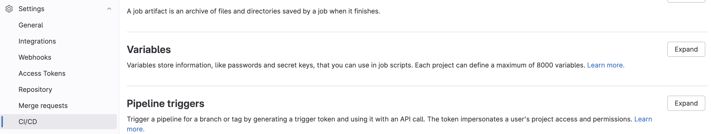
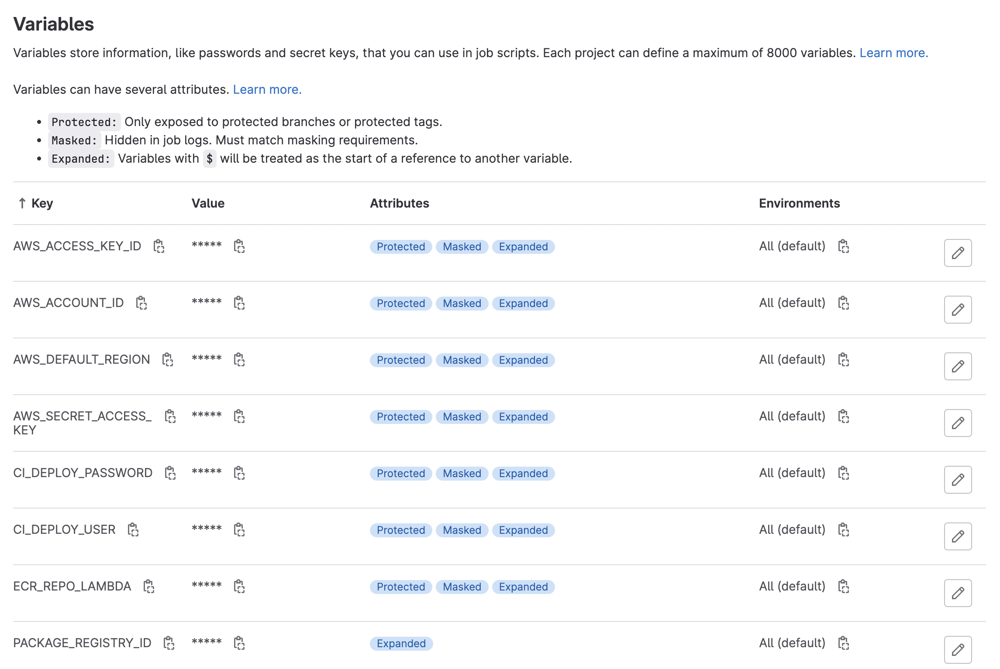

This is the second of two posts on designing Gitlab CI/CD pipelines.  The [first](  ) covered the anatomy of a `.gitlab-ci.yml` file, conditional jobs, and setting up the `.pypirc` and `.netrc` files that let a pipeline build a Python package and push it to a registry.

This post covers what happens after that: writing a Dockerfile to build an image from that package, and pushing the image to a container registry, both the Gitlab one and AWS ECR.

## Multi-stage Docker builds

I'm using what's called a "multi-stage" build.  This is exactly what it sounds like -- it breaks the process of building a Docker image into multiple stages.  In doing so, we often have the benefit of a final image that is smaller than a single-stage build, because we only include the artifacts needed to run our containerized application.  

Similarly, we can leverage multi-stage Docker builds to minimize duplicated code in Dockerfiles.  For example, let's say we have a scenario where we want to build an image for a `Production` environment as well as a `Test` environment.  The `Test` environment might include some additional dependencies, scripts, exports, etc. that the Production environment doesn't.  Instead of creating two Dockerfiles, one for each environment, we can define a single stage that encompasses the overlapping parts of both the `Production` and `Test` images, and then define the extra stuff in a separate stage to build the `Test` image.

In the example below, we have a three-stage Docker build, with stage names:
 * `base`: sets up some basic environment variables
 * `python-deps`: installs your package and creates a virtual environment
 * `runtime`: the actual application you want to run, with only the necessary files for running it

### Create a base image

```yaml
# set base image
# bigger base images yield slower image load times, and have more security vulnerabilities
FROM python:3.9-slim as base

# install virtual environment in ${project_dir}/.venv
ENV PIPENV_VENV_IN_PROJECT 1
# dont write .pyc files
ENV PYTHONDONTWRITEBYTECODE 1
# get some more information about faults when building images
ENV PYTHONFAULTHANDLER 1
```

### Install package dependencies

If you were building your Docker image locally, you'd have access to any authentication tokens or SSH keys necessary to pull from remote or private repositories.  However, Docker is naive to these variables -- we have to explicitly provide them at build time. Within the Dockerfile, we define three environment variables using the `ARG` keyword:
 1. `CI_DEPLOY_USER`
 2. `CI_DEPLOY_PASSWORD`
 3. `CI_JOB_TOKEN`

If you think that these variables look familiar, you're right.  They're the same pre-defined variables that exist in the context of a Gitlab CI/CD pipeline that act as authentication tokens for a `.pypirc` file and `.netrc` -- they're utilized by the `setup_tokens.sh` script to set up the `.pypirc` and `.netrc` files *within* the Docker image.

```yaml
# image for installing dependencies
# we only need .venv and app `runtime` image, not all other bloat
FROM base AS python-deps

####################################
# ----------------------------------
ARG CI_DEPLOY_USER
ARG CI_DEPLOY_PASSWORD
ARG CI_JOB_TOKEN
# ----------------------------------
####################################
```

These variables are available outside of the Docker image, but not within the image itself, so we need to "show" them to Docker at build time via the `--build-arg` flag:

```bash
docker build --build-arg CI_DEPLOY_USER=$CI_DEPLOY_URDER \
             --build-arg CI_DEPLOY_PASSWORD=$CI_DEPLOY_PASSWORD \
             --build-arg CI_JOB_TOKEN=$CI_JOB_TOKEN \
             ...
             ...
```

Now they are contained within the Docker image and can be provided to the `setup_tokens.sh` script, which then allows us to pull packages down from our remote package registry.  We also no longer need the SSH keys, since we're authenticating through Gitlab itself.

```yaml
# install pipenv in `python-deps` image
RUN python3 -m pip install pipenv
RUN apt-get update \
    && apt-get install --yes --no-install-recommends gcc g++ libffi-dev

# Dependency installation looks a little different for local packages
WORKDIR /home/app


# copy files to `python-deps` image
COPY setup.py setup_tokens.sh Pipfile Pipfile.lock ./
# copy over application-specific code that you want to install
# this is unique to my specific project -- use your own directories here
COPY templateci/ templateci/

# run setup_tokens script to setup .pypirc and .netrc within image
RUN chmod +x ./setup_tokens.sh && ./setup_tokens.sh

# authentication tokens are now available to pipenv
RUN python3 -m pipenv install --deploy --dev

# get rid of unnecessary libraries after install
RUN apt-get autoremove --yes gcc g++ libffi-dev \
    && rm -rf /var/lib/apt/lists/*
```

### Create your final runtime image

Above, we created the virtual environment that allows our application to run.  As such, we no longer need the raw source code or any other random files that were contained in the original project directory that might have been needed to build the virtual environment.  Now we create a stage called `runtime` in which we copy over the generated virtual environment from the previous stage

```yaml
# image for running the application
FROM base AS runtime

# Copy virtual environment from `python-deps` image to `runtime` image
COPY --from=python-deps /home/app/.venv /.venv
# add virtual environment to PATH
ENV PATH="/.venv/bin:$PATH"

# Create new user -- app will run as new user
RUN useradd --create-home -u 1099 user
WORKDIR /home/user/app
USER user

COPY . .

CMD ["python3", "-m", "pytest"]
```

This is the actual image that gets run when we call

```bash
docker run ${IMAGE_NAME}
```

---

## Pushing to AWS ECR

The [conditional job]( #conditional-pipeline-jobs ) at the end of the first post pushed an image to the Gitlab Container Registry.  Pushing to a remote AWS Elastic Container Registry (ECR) instead follows the same structure, with a different base image and a different authentication step.

### Setting up AWS variables

To build images, tag them, and push them to the remote AWS ECR, I used the definition of a CI/CD job below.  In addition to pre-defined variables that are set internally by Gitlab, we can also manually pre-define variables.  In this case, I've set a few that allow me to interact with AWS via the command line:
 * `AWS_DEFAULT_REGION`: self-explanatory
 * `ECR_REPO_LAMBDA`: `${AWS_ACCOUNT_ID}`.dkr.ecr.`${AWS_DEFAULT_REGION}`.amazonaws.com/`${YOUR_ECR_REPO_NAME}`
 * `AWS_ACCOUNT_ID`: AWS account ID
 * `AWS_ACCESS_KEY`: this is the information contained in the downloaded *.pem file
 * `AWS_SECRET_ACCESS_KEY`: this is the information contained in the downloaded *.pem file

To set variables that are accessible by CI/CD jobs, go to your **Project/Group > Settings > CI/CD > Variables > Expand** and define the variables of interest:





If you define these variables at the Gitlab Group level, they will be propagated down to the project level, so long as the Project falls under the Group scope.

### Pushing to AWS ECR via CI/CD job

Below, we define the actual CI/CD job.   There were two aspects here that I needed to solve.  First, I needed access to a Docker-in-Docker build image e.g. an image that had Docker installed.  And second, this image also needed to have the AWS CLI tool installed.  To that end, I used the `bentolor/docker-dind-awscli` [image](https://github.com/bentolor/docker-dind-awscli).

```yaml
build-image-ecr:
  stage: deploy 
  image: bentolor/docker-dind-awscli
  services:
    - docker:dind
  variables:
    # convenience variable indicating name of the image with respect to the ECR repo and unique tag ID
    IMAGE_TAG: $ECR_REPO_LAMBDA:$CI_COMMIT_SHORT_SHA

  before_script:
    - docker info
    # authenticate docker with your AWS ECR account
    - aws ecr get-login-password --region $AWS_DEFAULT_REGION | docker login --username AWS --password-stdin $AWS_ACCOUNT_ID.dkr.ecr.$AWS_DEFAULT_REGION.amazonaws.com
  # will push Docker image to AWS ECR
  script:
    # build the docker imagae
    - docker build --compress -t ${IMAGE_TAG} .
    # tag the image with a unique name
    - docker tag ${IMAGE_TAG} $ECR_REPO_LAMBDA:latest
    # push the image to the ECR
    - docker push ${IMAGE_TAG}

  # here, we only build and push the image if this is a merge event into the "main" branch
  rules:
    - if: $CI_PIPELINE_SOURCE == 'merge_request_event' && $CI_MERGE_REQUEST_TARGET_BRANCH_NAME == "main"
```

And voila!  You have now pushed your built image to a remote container registry!
