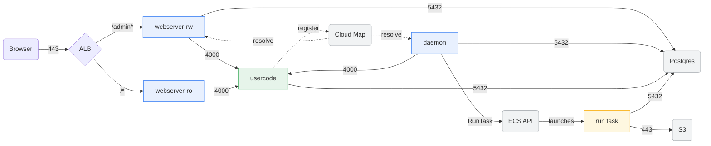

Here at Just-Evotec Biologics, the Data Platform team uses Dagster as our orchestration platform of choice.  Many of our services are deployed to AWS ECS as Fargate or EC2 tasks.  Getting Dagster onto ECS took me an embarrassing number of hours, and most of those issues stemmed from a lack of documentation around getting Dagster pipelines up and running in the cloud while NOT using Dagster+ (their premium service offering). The official docs cover the happy, perfect world path, but beyond that, you're left stitching together forum threads, GitHub issues, and a lot of trial and error.  I figured I'd put together some notes on what I built, and how I built it.

The components are of this system are two-fold -- the actual Python-based pipeline code, and the Terraform code I used to deploy that code to ECS.  The Terraform part also comes in two pieces, because I've split the deployment down the middle. In this post, I'll detail the platform half: the long-lived infrastructure everything else plugs into, such as the webserver and the daemon. [Part two]() covers the pipeline module, what you'd instantiate per pipeline and then redeploy repeatedly as you make updates to the pipeline code.

If you came here because something in your deployment cannot reach something else, it might be helpful for you to skip straight to the networking section, covering security groups, ports, service discovery.  But if not, read on...

---

## Setup

Our team already had a multi-environment AWS setup, with VPCs, subnets, security groups, tunneling, and load balancers in place. The goal was to plug Dagster into that existing infrastructure as cleanly as possible, with proper separation of concerns.  Again, as I mentioned in some other posts, I obviously can't share our company code, so I'll just describe some of the approaches I took.

I split the Terraform code into two distinct modules:

- **`dagster-platform`**: the long-lived infrastructure. Daemon, Webserver(s), shared IAM roles, ALB listener rules, SSM parameters, Cloud Map namespace, and S3/RDS backends.
- **`dagster-pipeline`**: one instantiation per pipeline. Each pipeline gets its own ECS task definitions, service, Cloud Map entry, IAM roles, and log groups. You call this module once per pipeline and it slots right into the platform.

This split makes sense from a frequency-of-interaction standpoint.  The platform piece deploys infrequently, and doesn't need to be modified much. Pipelines deploy constantly, sometimes multiple times a day, and I don't want to touch platform infrastructure every time I push a new job.

---

## Architecture overview

Here's the high-level picture:

```
ALB (existing)
  ├── /pipelines/admin/* → Webserver (read-write)  [Cognito-authenticated]
  └── /pipelines/*       → Webserver (read-only)   [Cognito-authenticated]

Supporting Services
  ├── RDS PostgreSQL          (run storage, event log, schedule storage)
  ├── S3                      (compute logs)
  ├── AWS Secrets Manager     (DB credentials, application secrets)
  ├── SSM Parameter Store     (dagster.yaml, workspace.yaml)
  └── Cloud Map               (service discovery for usercode servers)

ECS Cluster (existing)
  ├── dagster-daemon         (always-on Fargate service)
  ├── dagster-webserver-rw   (always-on Fargate service)
  ├── dagster-webserver-ro   (always-on Fargate service)
  └── pipeline-<name>        (always-on usercode service, one per pipeline)
```

Everything above the `pipeline-<name>` line is the platform -- that's what this current post is about. The Daemon and Webserver containers share the same `dagster.yaml` and `workspace.yaml`, loaded at runtime from SSM. Pipelines register themselves via Cloud Map so the Daemon can find them.

---

## The read-only webserver problem

Dagster's `dagster-webserver` supports a `--read-only` flag, but there's no built-in authentication layer that lets you say "scientists get read-only access, data engineers get admin access."  Dagster does have a subscription tier called Dagster+ that *does* offer this functionality, but we do not pay for that.  So, we're lefting putting our own solution in place.  I'm not sure if there is a "right" answer here.  One solution, given our constraints, is to combine Cognito with our IdP federation, but since I don't control our company's IdP tenant, I couldn't get that working. Instead, I deployed **two separate ECS services**, one read-write and one read-only, each behind its own ALB target group and listener rule.

**Read-write webserver command:**
```bash
dagster-webserver -h 0.0.0.0 -p 3000 \
  -w /opt/dagster/dagster_home/workspace.yaml \
  -l /pipelines/admin
```

**Read-only webserver command:**
```bash
dagster-webserver -h 0.0.0.0 -p 3000 \
  -w /opt/dagster/dagster_home/workspace.yaml \
  -l /pipelines \
  --read-only
```

The `-l` flag sets the URL prefix. The ALB rules do the routing:

- `/pipelines/admin*` → read-write target group (higher priority)
- `/pipelines*` → read-only target group (lower priority)

Both rules are Cognito-authenticated, so anyone hitting either URL has to log in. Scientists get the read-only URL. Engineers get the admin URL. Simple, but it works.

### Two actions per listener rule

An authenticated listener rule is two actions in order. The `authenticate-cognito` action runs first, then the `forward` action sends the request to the target group. If you only write the forward action, the rule works and nobody has to log in, which is the kind of mistake you don't notice until someone tells you they never saw a login screen.

```hcl
resource "aws_lb_listener_rule" "pipelines_admin_rw" {
  listener_arn = data.aws_alb_listener.webserver.arn
  priority     = local.admin_listener_priority

  action {
    type = "authenticate-cognito"
    authenticate_cognito {
      user_pool_arn       = data.aws_cognito_user_pool.dagster.arn
      user_pool_client_id = data.aws_cognito_user_pool_client.dagster.id
      user_pool_domain    = data.aws_cognito_user_pool.dagster.domain

      on_unauthenticated_request = "authenticate"
      scope                      = "openid"
      session_timeout            = 3600
    }
  }

  action {
    type             = "forward"
    target_group_arn = aws_lb_target_group.webserver_rw.arn
  }

  condition {
    path_pattern {
      values = ["/${var.alb_rule_listener_rule_path}/admin*"]
    }
  }
}
```

The read-only rule is identical except for the path pattern and target group, plus a `depends_on` pointing at the admin rule so the two are never created in the wrong order.

### Finding an open listener priority

ALB listener rule priorities have to be unique across the whole listener, and they need to be *specified*.  Neither Terraform nor AWS will "infer" the next open value. Our ALB is shared with other applications, so hardcoding numbers means constantly checking what's available in the console or through the CLI.  I ended up writing a small bash script that the `external` data source calls at `terraform plan` time. It lists the existing rules and returns the first `N` unused priority slots:

```hcl
data "external" "listener_priorities" {
  program = ["bash", "${path.module}/external/next_listener_priorities.sh"]

  query = {
    listener_arn = data.aws_alb_listener.webserver.arn
    region       = data.aws_region.current.id
    profile      = var.aws_profile
    count        = 2
  }
}

locals {
  admin_listener_priority = tonumber(data.external.listener_priorities.result.priority_1)
  ro_listener_priority    = tonumber(data.external.listener_priorities.result.priority_2)
}
```

And the script itself, which is a `jq` expression over `describe-rules`:

```bash
#!/usr/bin/env bash
set -euo pipefail

INPUT_JSON="$(cat)"
LISTENER_ARN="$(jq -r '.listener_arn' <<<"$INPUT_JSON")"
REGION="$(jq -r '.region' <<<"$INPUT_JSON")"
COUNT="$(jq -r '.count // 2' <<<"$INPUT_JSON")"

RULES_JSON="$(aws --region "$REGION" elbv2 describe-rules \
  --listener-arn "$LISTENER_ARN" --output json)"

# Find the first COUNT missing priorities in [1..50000]
jq -c --argjson count "$COUNT" '
  [ .Rules[].Priority | select(. != "default") | tonumber ] | unique as $used
  | reduce range(1; 50001) as $i
      ({out: []};
        if (.out | length) >= $count then .
        elif ($used | index($i)) == null then .out += [$i]
        else . end
      )
  | .out as $m
  | reduce range(0; ($m | length)) as $idx
      ({}; . + {("priority_" + (($idx + 1) | tostring)): ($m[$idx] | tostring)})
' <<<"$RULES_JSON"
```

The `external` data source runs on every plan, so the machine running Terraform needs the AWS CLI and `jq` installed and credentials that can call `describe-rules` (this could be your local machine, your CI/CD runner, an EC2 instance, etc.) The priorities are read at plan time, so if someone else claims a slot between your plan and your apply, the apply fails, though that's rare enough that I've been willing to live with it.  Basically, hardcoding priorities was not an option I wanted to entertain.

### Health checks and ALB path prefixes

The ALB health checks for the webservers need to use the correct path prefix. If your webserver is mounted at `/pipelines` and your health check pings `/`, it'll get a redirect (or a 404) and the target will never go healthy.

Read-only health check path: `/<your-prefix>`
Read-write health check path: `/<your-prefix>/admin`

```hcl
health_check {
  protocol            = "HTTP"
  path                = "/${var.alb_rule_listener_rule_path}/admin"
  matcher             = "200-399"
  healthy_threshold   = 2
  unhealthy_threshold = 3
  interval            = 30
  timeout             = 25
}
```

Set the matcher to `200-399` to handle redirects during startup. The Dagster webserver takes 15 to 30 seconds to come up on a cold start, so `unhealthy_threshold` and `interval` need to be generous enough that a slow container start doesn't put the service into a restart loop.

---

## dagster.yaml: the compute and storage specs

The `dagster.yaml` configuration basically let's you define job queing, which system will run your jobs (here, ECS), where logs and compute history will be stored, etc.  Here's what our final config looks like (pretty similar to what's already out there):

```yaml
run_coordinator:
  module: dagster.core.run_coordinator
  class: QueuedRunCoordinator
  config:
    max_concurrent_runs: 15

scheduler:
  module: dagster.core.scheduler
  class: DagsterDaemonScheduler

run_launcher:
  module: dagster_aws.ecs
  class: EcsRunLauncher
  config:
    use_current_ecs_task_config: true
    include_sidecars: true
    run_task_kwargs:
      cluster: "your-ecs-cluster-name"

compute_logs:
  module: dagster_aws.s3.compute_log_manager
  class: S3ComputeLogManager
  config:
    bucket:
      env: DAGSTER_LOG_BUCKET
    prefix: "compute_logs"
    region: "your-aws-region"

run_storage:
  module: dagster_postgres.run_storage
  class: PostgresRunStorage
  config:
    postgres_db:
      hostname: { env: DAGSTER_POSTGRES_HOSTNAME }
      username: { env: DAGSTER_POSTGRES_USER }
      password: { env: DAGSTER_POSTGRES_PASSWORD }
      db_name:  { env: DAGSTER_POSTGRES_DB }
      port: 5432

schedule_storage:
  module: dagster_postgres.schedule_storage
  class: PostgresScheduleStorage
  config:
    postgres_db:
      hostname: { env: DAGSTER_POSTGRES_HOSTNAME }
      username: { env: DAGSTER_POSTGRES_USER }
      password: { env: DAGSTER_POSTGRES_PASSWORD }
      db_name:  { env: DAGSTER_POSTGRES_DB }
      port: 5432

event_log_storage:
  module: dagster_postgres.event_log
  class: PostgresEventLogStorage
  config:
    postgres_db:
      hostname: { env: DAGSTER_POSTGRES_HOSTNAME }
      username: { env: DAGSTER_POSTGRES_USER }
      password: { env: DAGSTER_POSTGRES_PASSWORD }
      db_name:  { env: DAGSTER_POSTGRES_DB }
      port: 5432

retention:
  schedule:
    purge_after_days: 90
  sensor:
    purge_after_days:
      skipped: 7
      failure: 30
      success: -1
```

The ECS task configuration was confusing to me initially.  **`use_current_ecs_task_config: true`** tells the EcsRunLauncher to take the network configuration (subnets, security groups, cluster) from the task that requested the run rather than making you restate all of it in `run_task_kwargs`. Combined with a per-pipeline run task definition, which is covered in part two, it means each pipeline's runs launch into the same networking as that pipeline's code server, with that pipeline's own IAM roles. You don't need to define a shared task definition across pipelines, which keeps the principle of least privilege in play.

Every credential in that file is an `env:` reference, and nothing secret is in the file itself.

---

## Where the platform config lives

There are two config files: `dagster.yaml` (instance config, above) and `workspace.yaml` (the list of code locations the Daemon and Webserver load over gRPC).  Baking config into the Docker image means rebuilding and redeploying the image every time you tweak a config value. For the Daemon and Webserver that's a bad idea, because those images almost never change, but the config does. So Terraform writes both files into SSM parameters:

```hcl
resource "aws_ssm_parameter" "dagster_yaml" {
  name  = "${var.ssm_prefix}/dagster.yaml"
  type  = "String"
  value = var.dagster_yaml
}

resource "aws_ssm_parameter" "workspace_yaml" {
  name  = "${var.ssm_prefix}/workspace-${var.platform_env}.yaml"
  type  = "String"
  value = var.workspace_yaml
}
```

and the task definitions inject them as container secrets:

```hcl
locals {
  dagster_config_ssm_secrets = [
    { name = "DAGSTER_YAML",   valueFrom = aws_ssm_parameter.dagster_yaml.arn },
    { name = "WORKSPACE_YAML", valueFrom = aws_ssm_parameter.workspace_yaml.arn },
  ]

  common_platform_env = [
    { name = "DAGSTER_CONFIG_FROM_ENV", value = "1" },
    { name = "DAGSTER_DEPLOYMENT_ENV",  value = var.platform_env },
    { name = "DAGSTER_HOME",            value = var.dagster_home },
    { name = "DAGSTER_LOG_BUCKET",      value = "${var.dagster_log_bucket}-${var.platform_env}" },
  ]
}
```

`DAGSTER_CONFIG_FROM_ENV` is a flag the entrypoint script checks. When it's set, the script writes `$DAGSTER_YAML` and `$WORKSPACE_YAML` out to `$DAGSTER_HOME/dagster.yaml` and `$DAGSTER_HOME/workspace.yaml` before starting the process, and leaves whatever is in the image alone otherwise. Changing a config value is then an SSM update and a service restart, not a full image rebuild and redeployment.

The ECS `secrets` block works with plain SSM `String` parameters, not just `SecureString` and Secrets Manager, and standard SSM parameters are capped at 4KB of value, so a `workspace.yaml` with a lot of code locations will eventually need an advanced parameter (8KB) or a different mechanism.  Pipeline containers do the opposite and ship their config in the image. That's covered in [Part Two]().  I also changed my mind about it after writing these posts, so I add some thoughts about that as well.

---

## Networking: the part that took me the longest

I found the networking stuff to be the most confusing.  Multiple features all have to be correct before anything communicates to anything else.

### What talks to what

Before any of the Terraform, it was worthwhile to me to write the traffic down explicitly, because the number of distinct flows is small and each flow has to be allowed somewhere:



Blue is the platform module, green is a pipeline, amber is the ephemeral run task, grey is something AWS runs for you. Solid arrows are request traffic, labelled with the port. Dotted arrows are service discovery, which carries no application data.  Here is the same thing as a table:

| From | To | Port | Why |
|---|---|---|---|
| ALB | Webserver | 3000 (`webserver_port`) | Serving the UI |
| Webserver | Usercode server | 4000 | Loading code locations over gRPC |
| Daemon | Usercode server | 4000 | Polling schedules and sensors |
| Daemon | ECS API | 443 | `RunTask` to launch runs |
| Daemon | EC2 API | 443 | `DescribeNetworkInterfaces` to resolve task IPs |
| Daemon, Webserver, Usercode, Run | RDS Postgres | 5432 | Run storage, event log, schedule storage |
| Daemon, Webserver, Usercode, Run | S3 | 443 | Compute logs |
| All tasks (at startup) | ECR, Secrets Manager, SSM, CloudWatch Logs | 443 | Pulling the image, injecting secrets and config |

The Daemon never receives inbound traffic from anything, so its security group needs no ingress rules at all.

### Three security groups

The platform module creates all three security groups, including the one used by pipelines. The usercode security group uses security group references, not CIDR blocks, to restrict inbound port 4000 to *only* the Daemon and Webserver, so nothing else in the VPC can reach a code server.  While a CIDR rule like `10.0.0.0/16` would work too, doing so means anything that gets a private IP in that range can open a gRPC connection to your code servers, and you don't want that. A code server could tell any caller what jobs exist and let them be launched. Referencing the daemon and webserver security groups instead means the rule stays correct as subnets change and there's no CIDR math to get wrong.

```hcl
# dagster-platform/vpc.tf

# Daemon: outbound-only. It talks to ECS APIs and usercode servers, never receives inbound.
resource "aws_security_group" "daemon" {
  name        = "${var.name_prefix}-daemon-sg-${var.env}"
  description = "Dagster Daemon. Outbound only."
  vpc_id      = var.vpc_id

  egress {
    description = "Allow all outbound"
    from_port   = 0
    to_port     = 0
    protocol    = "-1"
    cidr_blocks = ["0.0.0.0/0"]
  }
}

# Webserver: inbound from ALB only, on the webserver port.
resource "aws_security_group" "webserver" {
  name        = "${var.name_prefix}-webserver-sg-${var.env}"
  description = "Dagster webservers (RO+RW). Inbound from ALB only."
  vpc_id      = var.vpc_id

  ingress {
    description     = "Inbound from ALB security group"
    from_port       = var.webserver_port
    to_port         = var.webserver_port
    protocol        = "tcp"
    security_groups = [var.alb_sg_id]   # reference your existing ALB SG here
  }

  egress {
    description = "Allow all outbound"
    from_port   = 0
    to_port     = 0
    protocol    = "-1"
    cidr_blocks = ["0.0.0.0/0"]
  }
}

# Usercode servers: inbound TCP 4000 from daemon and webserver SGs only.
# This SG is shared across all pipeline usercode services.
resource "aws_security_group" "usercode" {
  name        = "${var.name_prefix}-usercode-sg-${var.env}"
  description = "Dagster usercode. Allow TCP 4000 from daemon and webserver only."
  vpc_id      = var.vpc_id

  ingress {
    description     = "gRPC from daemon and webserver"
    from_port       = 4000
    to_port         = 4000
    protocol        = "tcp"
    security_groups = [
      aws_security_group.daemon.id,
      aws_security_group.webserver.id,
    ]
  }

  egress {
    description = "Allow all outbound"
    from_port   = 0
    to_port     = 0
    protocol    = "-1"
    cidr_blocks = ["0.0.0.0/0"]
  }
}
```

The usercode security group is defined here and looked up by name in each pipeline module, so the platform owns the definition and pipelines just join it.

### How do tasks get their networking?

The Dagster documentation unfortunately does not describe this clearly. There is no security group anywhere in the Terraform for run tasks.  So how do they run?  As I mentioned above, the answer is `use_current_ecs_task_config: true` in `dagster.yaml`. When the EcsRunLauncher launches a run, it reads the network configuration of the task making the request (the usercode code server) and reuses it. Run tasks land in the same subnets and the same usercode security group as the code server that spawned them automatically.  Meaning:

- A run task inherits inbound 4000 from the daemon and webserver
- A run task needs the same **egress** as the code server: Postgres to write events, S3 for compute logs, and everything in the startup list below. Egress is where run tasks actually fail, never ingress.
- If you lock the usercode security group's egress down, you're locking down runs too, and the failure will look like a job that starts and then hangs rather than a network error.

Each pipeline's runs get that pipeline's networking and that pipeline's IAM roles, with nothing shared and nothing restated. The pipeline's tasks are inheriting the networking rules defined for that whole pipeline.

### Private Subnets Need a Path to AWS APIs

All of these tasks run in private subnets with `assign_public_ip = false`.  A Fargate task in a private subnet still has to reach several AWS endpoints over the AWS API surface before that container code runs at all: ECR to pull the image (both the API and the layer storage in S3), Secrets Manager and SSM to inject secrets and config, and CloudWatch Logs to write those outputs. That traffic needs either a NAT gateway in the route table or VPC interface endpoints for each of those services, plus an S3 gateway endpoint.  Our VPC already had a NAT gateway, so I leveraged that.  If that path is missing, the task doesn't fail in a way that mentions networking. It sits in `PROVISIONING` or `PENDING`, then stops with a `ResourceInitializationError` about being unable to pull the image or retrieve a secret. Nothing in the container logs, because the container never started, and nothing in the Dagster UI, because Dagster never got far enough to know about it.

### What Each Failure Actually Looks Like

This table contains rough debugging notes I wish I'd had:

| Symptom | Usual cause |
|---|---|
| Task stuck in `PROVISIONING`, then `ResourceInitializationError` | No egress path from the private subnet. Missing NAT route or VPC endpoints |
| Code location shows as failed in the UI, gRPC deadline exceeded | Usercode SG isn't allowing 4000 from the webserver SG |
| Schedules and sensors never tick, but the UI loads fine | Same rule, but the daemon SG. The webserver and daemon are separate sources |
| Code location resolves intermittently after a deploy | Cloud Map DNS TTL still serving the old task's IP. See part two |
| ALB target never goes healthy | Health check path missing the URL prefix, or the matcher rejecting a redirect |
| Runs launch and immediately fail with no logs | IAM, not networking. Usually the missing `ecs:TagResource` |
| Run starts, then hangs without writing events | Egress from the usercode SG. Run tasks inherit it |


Generally, if you're seeing an error, I'd start with examining the IAM roles first.

---

## Service Discovery: The Namespace

The Daemon needs to find each pipeline's code server. On ECS Fargate, the standard approach is AWS Cloud Map (private DNS). The platform creates the namespace, and each pipeline creates its own service record within it.

```hcl
# dagster-platform/cloud_map.tf

resource "aws_service_discovery_private_dns_namespace" "dagster" {
  name        = "pipelines-${var.env}.usercode"   # e.g. "pipelines-prod.usercode"
  description = "Private DNS namespace for Dagster usercode servers"
  vpc         = var.vpc_id
}
```

Two requirements come with a private DNS namespace. It's bound to exactly one VPC, so a multi-VPC setup needs a namespace per VPC (which is part of why the name carries the environment). And the VPC needs both `enableDnsSupport` and `enableDnsHostnames` turned on, or the records resolve from nothing and every code location fails to load with what looks like a connection error rather than a DNS one.

---

## IAM: Probably the crux of everything

There are two IAM roles per service: an **execution role** (used by ECS to pull images, write logs, and fetch secrets before the container starts) and a **task role** (used by the running container to call AWS APIs at runtime). Regarding AWS secrets: if the value is injected by the ECS `secrets` block in the task definition, the **execution** role needs to read it, because *something* needs to inject it into the task definition. If your application code calls `boto3` to fetch it, the **task** role needs to read it.  Yes, I was confused initially too.

### The Shared Trust Policy

All ECS task roles share the same trust policy:

```hcl
data "aws_iam_policy_document" "ecs_task_assume_role" {
  statement {
    actions = ["sts:AssumeRole"]
    principals {
      type        = "Service"
      identifiers = ["ecs-tasks.amazonaws.com"]
    }
  }
}
```

### Execution Roles (Webserver + Daemon)

Execution roles need the standard ECS managed policy, plus access to Secrets Manager and SSM so ECS can inject those values before the container starts:

```hcl
# dagster-platform/iam.tf

resource "aws_iam_role" "daemon_execution" {
  name               = "${var.name_prefix}-daemon-exec-role-${var.env}"
  assume_role_policy = data.aws_iam_policy_document.ecs_task_assume_role.json
}

resource "aws_iam_role_policy_attachment" "daemon_exec_attach" {
  role       = aws_iam_role.daemon_execution.name
  policy_arn = "arn:aws:iam::aws:policy/service-role/AmazonECSTaskExecutionRolePolicy"
}

# Execution role needs Secrets Manager access so ECS can inject secrets into the container
resource "aws_iam_role_policy" "daemon_exec_db_secret" {
  name   = "${var.name_prefix}-daemon-exec-db-secret-${var.env}"
  role   = aws_iam_role.daemon_execution.id
  policy = data.aws_iam_policy_document.dagster_db_secret_read.json
}

# Execution role needs SSM access to inject dagster.yaml and workspace.yaml as env vars
resource "aws_iam_role_policy" "daemon_exec_ssm" {
  name   = "${var.name_prefix}-daemon-exec-ssm-${var.env}"
  role   = aws_iam_role.daemon_execution.id
  policy = data.aws_iam_policy_document.dagster_ssm_read.json
}
```

The webserver execution role is identical in structure.

### Daemon Task Role

The Daemon's task role needs to launch, describe, stop, and tag ECS run tasks.  Dagster tags every run task it spawns with run metadata, and if the permission is absent, runs will launch and then immediately fail.

```hcl
resource "aws_iam_role" "daemon_task" {
  name               = "${var.name_prefix}-daemon-task-role-${var.env}"
  assume_role_policy = data.aws_iam_policy_document.ecs_task_assume_role.json
}

# Allow launching run tasks for any task def matching "pipeline-*-run-*"
# Scoped to the specific cluster so the daemon can't escape to other clusters
data "aws_iam_policy_document" "ecs_run_tasks" {
  statement {
    sid     = "RunDescribeStopRunTasks"
    effect  = "Allow"
    actions = ["ecs:RunTask", "ecs:DescribeTasks", "ecs:StopTask"]
    resources = [
      "arn:aws:ecs:${var.region}:${data.aws_caller_identity.current.account_id}:task-definition/pipeline-*-run-*:*",
      "arn:aws:ecs:${var.region}:${data.aws_caller_identity.current.account_id}:task/${var.cluster_name}/*",
    ]
    condition {
      test     = "ArnEquals"
      variable = "ecs:cluster"
      values   = [data.aws_ecs_cluster.cluster.arn]
    }
  }

  # DescribeTaskDefinition has no resource-level support, must be "*"
  statement {
    sid       = "DescribeTaskDefinitions"
    effect    = "Allow"
    actions   = ["ecs:DescribeTaskDefinition"]
    resources = ["*"]
  }
}

resource "aws_iam_role_policy" "daemon_ecs_run" {
  name   = "${var.name_prefix}-daemon-ecs-run-${var.env}"
  role   = aws_iam_role.daemon_task.id
  policy = data.aws_iam_policy_document.ecs_run_tasks.json
}

# Allow tagging ECS tasks. Without this, Dagster run tasks fail silently at launch.
data "aws_iam_policy_document" "ecs_tag_resource" {
  statement {
    sid     = "AllowTagEcsTasks"
    effect  = "Allow"
    actions = ["ecs:TagResource"]
    resources = [
      "arn:aws:ecs:${var.region}:${data.aws_caller_identity.current.account_id}:task/${var.cluster_name}/*"
    ]
  }
}

resource "aws_iam_role_policy" "daemon_ecs_tag" {
  name   = "${var.name_prefix}-daemon-ecs-tag-${var.env}"
  role   = aws_iam_role.daemon_task.id
  policy = data.aws_iam_policy_document.ecs_tag_resource.json
}

# The daemon also needs ec2:DescribeNetworkInterfaces to resolve Fargate task IPs
resource "aws_iam_role_policy" "daemon_describe_enis" {
  name   = "${var.name_prefix}-daemon-describe-enis-${var.env}"
  role   = aws_iam_role.daemon_task.id
  policy = data.aws_iam_policy_document.ec2_describe_enis.json
}
```

### PassRole Contract

The last piece of the daemon's task role is the one that ties the two modules together. To launch a run task, the daemon has to pass that task's execution and task roles to ECS, and THOSE roles live in the pipeline module, not here.  The naive version grants `iam:PassRole` on `*`, which hands the daemon the ability to pass any role in the account to ECS, but that doesn't follow the principle of least priviledge. Instead, I scoped it with tag conditions:

```hcl
data "aws_iam_policy_document" "ecs_pass_dagster_roles" {
  statement {
    sid     = "PassOnlyDagsterRunRoles"
    effect  = "Allow"
    actions = ["iam:PassRole"]
    resources = ["*"]   # resource-level not supported for PassRole; use tag conditions instead

    condition {
      test     = "StringEquals"
      variable = "iam:PassedToService"
      values   = ["ecs-tasks.amazonaws.com"]
    }
    # Only allow passing roles tagged as dagster pipeline components
    condition {
      test     = "StringEquals"
      variable = "iam:ResourceTag/dagster:component"
      values   = ["pipeline"]
    }
    condition {
      test     = "StringEquals"
      variable = "iam:ResourceTag/dagster:managed-by"
      values   = ["terraform"]
    }
  }
}

resource "aws_iam_role_policy" "daemon_pass_roles" {
  name   = "${var.name_prefix}-daemon-pass-run-roles-${var.env}"
  role   = aws_iam_role.daemon_task.id
  policy = data.aws_iam_policy_document.ecs_pass_dagster_roles.json
}
```

`iam:PassRole` doesn't support resource-level scoping the way you'd want, so `"*"` plus a strict tag condition is the practical answer. That means that you can add new pipelines without ever touching the platform's IAM policies. As long as a new pipeline's run roles carry the right tags, the daemon can pass them.

---

## What the Platform Expects From a Pipeline

In actuality, the tag condition is really a contract.  To plug into this Dagster platform, a pipeline has to:

1. Register a service in the Cloud Map namespace, so the Daemon and Webserver can resolve it by DNS on port 4000.
2. Attach its usercode service to the platform's usercode security group, so that traffic is actually allowed.
3. Tag its run roles with `dagster:component` and `dagster:managed-by`, so the Daemon is permitted to pass them to ECS.
4. Get its code location into `workspace.yaml` in SSM, so the Webserver and Daemon know it exists.

[Part two](  ) covers the module that does all four, plus the two-task-definition pattern, secrets, and how deploys actually roll a new image onto ECS.
