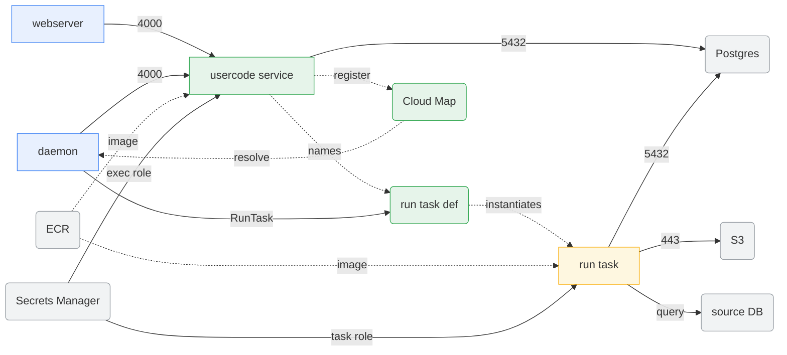

Here is the second of two posts on running Dagster in ECS. The [first](  ) dealt with the platform side: the Daemon, the two Webservers, the ALB and Cognito wiring, the three security groups, the Cloud Map namespace, and the IAM that lets the Daemon launch anything at all.

The first component I referred to as `dagster-platform`.  This one is about what I'm referring to as `dagster-pipeline`, the module you instantiate once per pipeline.  Platform infrastructure gets deployed infrequently. Pipelines get deployed several times a day by whoever happens to be working on them.  The reason I separated the two is that pushing a new job should never touch a security group, an IAM policy, or a load balancer rule.

---

## The Contract

[Part One](  ) ended with the four things the platform expects from a pipeline:

1. Register a service in the Cloud Map namespace, so the Daemon and Webserver can resolve it by DNS on port 4000.
2. Attach the usercode service to the platform's usercode security group, so that traffic is actually allowed.
3. Tag its run roles with `dagster:component` and `dagster:managed-by`, so the Daemon is permitted to pass them to ECS.
4. Get its code location into `workspace.yaml` in SSM, so the Webserver and Daemon know it exists.

The platform defines the security group and the pipeline looks it up by name:

```hcl
# dagster-pipeline/ecs.tf
data "aws_security_group" "usercode" {
  name = "${var.usercode_sg}-${var.platform_env}"
}
```

Here is the whole module and everything it touches. Blue is the platform, which this module does not create and only attaches to. Green is what the pipeline module builds.



The run task definition is a *definition*, not a running thing: the usercode container names it in an environment variable, and the daemon is what actually instantiates it. The arrows pointing into the Secrets Manager land on different roles, because the usercode service has its credentials injected by ECS before it starts while the run task reads them itself at runtime.

---

## The Two-Task-Definition Pattern

Each pipeline module creates **two** task definitions:

**`usercode` task definition**: the always-on code server. This runs `dagster code-server start` and stays alive, serving job definitions, sensors, schedules, and so on to the Daemon. It registers with Cloud Map so the platform can discover it.

**`run` task definition**: the task that executes a job. When a run is triggered, the EcsRunLauncher spins up a new Fargate task using this definition. It's ephemeral, meaning it starts, runs the job, and exits.

The two definitions point at the same image and differ mainly in CPU/memory and in which IAM roles they use. The `run` definition's `command` doesn't really matter, since the launcher overrides it with the actual run command, but I set it to the same code-server command so that starting the task by hand does something reasonable.  The usercode container needs to know about the run task definition so it can tell Dagster which task to launch, which can be achieved with two environment variables.

```hcl
locals {
  dagster_current_image_env = [
    { name = "DAGSTER_CURRENT_IMAGE", value = data.aws_ecr_image.usercode.image_uri }
  ]

  dagster_container_context = {
    ecs = {
      task_definition_arn = aws_ecs_task_definition.run.arn
      container_name      = "run"
    }
  }

  dagster_container_context_env = [
    { name = "DAGSTER_CONTAINER_CONTEXT", value = jsonencode(local.dagster_container_context) }
  ]
}
```

`DAGSTER_CURRENT_IMAGE` is the pipeline's ECR image URI. `DAGSTER_CONTAINER_CONTEXT` tells Dagster which ECS task definition and container name to use for runs. Note that `container_name` has to match the `name` field of the container in the run task definition exactly. If it doesn't, the run task launches and Dagster can't find the container it's supposed to be watching.  Both of these go on the **usercode** container only, not the run container. Building `DAGSTER_CONTAINER_CONTEXT` from `aws_ecs_task_definition.run.arn` also creates the dependency that forces Terraform to build the run task definition first.

---

## Registering With Cloud Map

The platform created the private DNS namespace, and each pipeline creates its own service record inside of that DNS namespace:

```hcl
# dagster-pipeline/cloud_map.tf

# Look up the namespace created by the platform module
data "aws_service_discovery_dns_namespace" "dagster" {
  type = "DNS_PRIVATE"
  name = "pipelines-${var.env}.usercode"
}

# Each pipeline gets its own service record in the shared namespace
resource "aws_service_discovery_service" "usercode" {
  name = "${var.pipeline_name}-pipeline-${var.env}"

  dns_config {
    namespace_id = data.aws_service_discovery_dns_namespace.dagster.id

    dns_records {
      ttl  = 300
      type = "A"
    }

    routing_policy = "MULTIVALUE"
  }
}
```

The ECS service ties itself to that record with a `service_registries` block, and from then on ECS registers the Fargate task's private IP with Cloud Map automatically:

```hcl
resource "aws_ecs_service" "usercode" {
  # ...
  service_registries {
    registry_arn = aws_service_discovery_service.usercode.arn
  }
}
```

The DNS name becomes `<pipeline-name>-pipeline-<env>.pipelines-<env>.usercode`, which goes into `workspace.yaml`:

```yaml
# workspace.yaml (stored in SSM)
load_from:
  - grpc_server:
      host: ingest-pipeline-prod.pipelines-prod.usercode
      port: 4000
      location_name: "ingest"
  - grpc_server:
      host: transforms-pipeline-prod.pipelines-prod.usercode
      port: 4000
      location_name: "transforms"
```

"ingest" and "transforms" are what you see in the Dagster webserver when looking at each of your pipeline deployments.

### TTL and Task Replacement

The `ttl = 300` in that `dns_records` is important here.  Fargate tasks get a new private IP every time they're replaced, and a code server is replaced on every deploy. Cloud Map updates the A record immediately, but the Daemon and Webserver are resolving that name through the VPC resolver, which respects the TTL. For a few minutes after a deploy, they can be holding the IP of a task that no longer exists, and in practice, that means that a code location goes red (a.k.a looks like a failed deployment in the UI) in the UI right after a deploy and then fixes itself a few minutes later. Decreasing the TTL to 15 or 30 seconds makes deploys settle much faster, at the cost of more DNS queries, which for a handful of code servers is probably acceptable.

`routing_policy = "MULTIVALUE"` returns every healthy instance registered under the name. With `desired_count = 1` there's only ever one, but it's the right policy if you later run more than one replica of a code server.  Similarly, when you add a new pipeline, you need to update `workspace.yaml` in SSM and restart the Daemon and Webserver services so they pick up the new entry. I'm currently running this manually, but it's worth automating in the future (but not a deal-breaker, just not something I'd consider "complete").

---

## Four Roles Per Pipeline

Each pipeline module creates four IAM roles: execution and task roles for both the **usercode** service (always-on code server) and the **run** task (ephemeral, launched per job execution).

Just like I mentioned in [Part One](  ), if you're handling AWS secrets, if the value is injected by the ECS `secrets` block in the task definition, the **execution** role needs to read it. If your application code calls `boto3` to fetch it, the **task** role needs to read it.

The roles are structurally identical, but the tags differ.  The tags are what the platform's `iam:PassRole` condition checks against:

```hcl
# dagster-pipeline/iam.tf

locals {
  usercode_role_tags = {
    "dagster:component"  = "usercode"
    "dagster:pipeline"   = var.pipeline_name
    "dagster:managed-by" = "terraform"
  }

  run_role_tags = {
    "dagster:component"  = "run"
    "dagster:pipeline"   = var.pipeline_name
    "dagster:managed-by" = "terraform"
  }
}

# Run execution role, used by ECS to start the ephemeral run container
resource "aws_iam_role" "run_exec" {
  name               = "${var.name_prefix}-${var.pipeline_name}-run-exec-role-${var.pipeline_env}"
  assume_role_policy = data.aws_iam_policy_document.ecs_task_assume_role.json
  tags               = merge(local.run_role_tags, var.tags)
}

resource "aws_iam_role_policy_attachment" "run_exec_attach" {
  role       = aws_iam_role.run_exec.name
  policy_arn = "arn:aws:iam::aws:policy/service-role/AmazonECSTaskExecutionRolePolicy"
}

# Run task role, used by the running job container to call AWS APIs
resource "aws_iam_role" "run_task" {
  name               = "${var.name_prefix}-${var.pipeline_name}-run-task-role-${var.pipeline_env}"
  assume_role_policy = data.aws_iam_policy_document.ecs_task_assume_role.json
  tags               = merge(local.run_role_tags, var.tags)
}
```

### The Empty Resource List Trap

IAM rejects a policy statement with an empty `Resource` list, so a pipeline that connects to no databases can't just get a policy document with zero ARNs in it. The document has to not exist at all:

```hcl
data "aws_iam_policy_document" "db_secrets_read" {
  # A pipeline that reads no databases must not get this policy at all.
  count = length(var.db_secret_ids) > 0 ? 1 : 0

  statement {
    sid       = "ReadDatabaseSecrets"
    effect    = "Allow"
    actions   = ["secretsmanager:GetSecretValue", "secretsmanager:DescribeSecret"]
    resources = [for s in data.aws_secretsmanager_secret.db_secrets : s.arn]
  }
}

resource "aws_iam_role_policy" "run_db_secrets" {
  count  = length(var.db_secret_ids) > 0 ? 1 : 0
  name   = "${var.name_prefix}-${var.pipeline_name}-run-db-secrets-${var.pipeline_env}"
  role   = aws_iam_role.run_task.id
  policy = data.aws_iam_policy_document.db_secrets_read[0].json
}
```

---

## Secrets Management

I'm using two different categories of secrets.  **Dagster's own Postgres credentials** are stored as a single Secrets Manager secret with JSON keys. These get injected as individual environment variables using the JSON key syntax in the ECS task definition `secrets` block:

```hcl
locals {
  dagster_container_secrets = [
    {
      name      = "DAGSTER_POSTGRES_HOSTNAME"
      valueFrom = "${data.aws_secretsmanager_secret.dagster_postgres.arn}:hostname::"
    },
    {
      name      = "DAGSTER_POSTGRES_USER"
      valueFrom = "${data.aws_secretsmanager_secret.dagster_postgres.arn}:username::"
    },
    {
      name      = "DAGSTER_POSTGRES_PASSWORD"
      valueFrom = "${data.aws_secretsmanager_secret.dagster_postgres.arn}:password::"
    },
    {
      name      = "DAGSTER_POSTGRES_DB"
      valueFrom = "${data.aws_secretsmanager_secret.dagster_postgres.arn}:name::"
    }
  ]
}
```

The `:key::` suffix trailing fields are the version stage and version ID.  When those are empty, you get the most recent / current version. Since these are injected by ECS, the **execution** role is what needs `GetSecretValue` on the secret.

**Source database credentials** (for pipelines that read from other databases) are not injected at all anymore. My first version of the Terraform module wrote a `.pgpass` file at container startup: each secret ID came in as `PGPASS_SECRET_JSON_1`, `PGPASS_SECRET_JSON_2` and so on, plus a `PGPASS_SECRET_JSON_VARS` variable listing which env vars to look at, and the entrypoint fetched each one and assembled the file. It worked, but it was messy and became really annoying to manage since I was dragging around another script for building the .pgpass file.  It also meant credentials sat in the container environment and on disk for the life of the task, the entrypoint had to grow a chunk of logic that had nothing to do with running jobs, so I replaced it with the following

```hcl
variable "db_secret_ids" {
  type        = list(string)
  description = "Secrets Manager secrets for the databases this pipeline connects to. The task role is granted GetSecretValue on them; the application reads them at runtime."
  default     = []
}
```

```python
import json
import boto3


def get_connection_details(secret_id: str) -> dict:
    client = boto3.client("secretsmanager")
    secret = client.get_secret_value(SecretId=secret_id)
    return json.loads(secret["SecretString"])
```

The credentials are never in the environment and never on disk in the task, and adding a database is one more entry in a list variable.

---

## What I'd Do (and still might do...) Differently

**Automate workspace.yaml updates.** Right now, adding a pipeline requires a manual SSM update and service restart. A Lambda triggered by ECS task state changes, or even a simple CI step, could handle this.

**Use Cognito + proper OIDC federation for access control.** The dual-webserver approach works, but it's not pretty. If you control your IdP, set up Cognito federation from the start.  I tried setting up a proxy server to redirect traffic based on users belonging to one Cognito user-group or another, but this ended up being a huge headache.

**Consider ECS Exec for debugging.** I didn't enable it initially and spent a lot of time reading logs trying to diagnose container startup issues. `aws ecs execute-command` is worth the extra IAM policy on the task role.

**Don't put dagster.yaml in the platform images.** Storing it in SSM and injecting at runtime was the right call for the daemon and webserver. Rebuilding (EVERY) image every time you want to change a config is not the move. For pipeline images, where the code changes anyway, baking it in is fine and simpler.

**Fetch application secrets at runtime instead of injecting them.** See above. This is the change I'm happiest about.

---

## Actually, One More Thing

As I was writing up this post, I went back to the IAM code to check that I'd described the tag conditions correctly, and found a bug.

Here's the setup again. The platform's `iam:PassRole` policy only allows the Daemon to pass roles tagged `dagster:component = "pipeline"`. The pipeline module's local says something else:

```hcl
run_role_tags = {
  "dagster:component"  = "run"      # not "pipeline"
  "dagster:pipeline"   = var.pipeline_name
  "dagster:managed-by" = "terraform"
}
```

`"run"`, not `"pipeline"`. By that reading the Daemon should never be able to pass these roles, and every run should fail. But runs work fine in both environments, so I had never noticed.  The *correct* approach is in the IaC merge command

```hcl
tags = merge(local.run_role_tags, var.tags)
```

`merge` lets later arguments win, so `var.tags` overrides the module's own local. And every caller passes a tag block that happens to include exactly the key in question:

```hcl
tags = {
  "env"                = var.pipeline_env
  "owner"              = "data-platform"
  "application"        = "dagster"
  "dagster:pipeline"   = var.pipeline_name
  "dagster:component"  = "pipeline"    # this is what makes PassRole work
  "dagster:managed-by" = "terraform"
}
```

So the roles do come out tagged with `pipeline`, and the security control does work, but only because of the argument order in a `merge` and a tag the caller happens to set. A new pipeline that passes a `tags` map without `dagster:component` would plan clean, apply clean, start its code server, show up in the UI, and then fail the first time someone launched a run, with an AccessDenied on `PassRole` and nothing in the Terraform to suggest why.

The fix is to stop letting callers override the tag the policy depends on:

```hcl
tags = merge(var.tags, local.run_role_tags)
```

and change the platform condition to match `"run"`, which is the value the module actually controls.
---

## Wrapping Up

Getting Dagster onto ECS was genuinely hard for me. The documentation covers the "in a perfect world" scenario, but not the real-world complexity of integrating with existing cloud infrastructure that you don't partially (or entirely) control.  There are plenty of "in a perfect world with a clean slate, here's how you do it" walkthroughs, but very little in the way of justification or documentation of architecture choices.  The platform/pipeline split in Terraform has been a huge win for me.  I've templated our Dagster pipeline development platform and put together templated Dockerfiles and `docker-compose.yaml` files.  Deploying a new pipeline is now a `terraform apply` with a handful of variables, no platform infrastructure touched, no service restarts required (except for the workspace.yaml update, which I'm working on).
