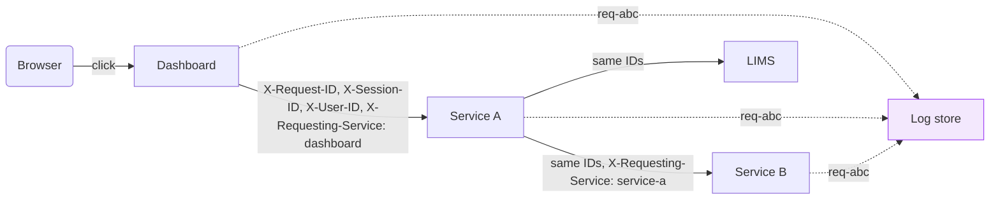

We are a pretty small team, yet we still have a pretty large and expansive suite of services, dashboards, and backend data systems.  When the number of services was small, auditting and logging was quite easy, but over the last few years, it's become quite a chore.  Imagine the following scenario:

A scientist tells you the page on the cell culture analysis dashboard was slow this morning.

If you can't answer at least one of the following, you might find this post helpful:

 1. Which page? 
 2. What do they mean "slow"? 
 3. Which user?
 4. When?
 5. What endpoint and what parameters?

The dashboard they're referring to called some backend API, that API called two more, and one of those queried the LIMS system directly. That's multiple services and log streams, and I'm willing to bet that not one line in any of them tells you which entries belong to that user's click.

We face this issue in a variety of places in our data platform.  I don't mean logging in the general sense of `import logging`, but the narrower scope of how a request identifies itself as it moves between all of our services, so that afterwards we can put the pieces back in order and say which step was slow, or which one returned the 403 error.

I built something that I've been slowly deploying and incorporating into most of our services and dashboards.  Three pieces do the work: a request-scoped context, middleware that fills it in, and a handful of headers forwarded on every outbound call. It pairs with [the previous post](  ) on service-to-service auth, since knowing *who* called and when is half the battle.

---

## What I wanted every line to carry

My goal for this tooling was that any single "typical" log line, anywhere in the system, can answer which request, which user, which service, which endpoint, how long, and what happened. This ends up being a fixed set of fields stamped onto every record key:

| Field | Example | Why |
|---|---|---|
| `request_id` | `req-474c2493-...` | Ties every line from one request together, across services |
| `session_id` | `ses-a55813da-...` | Ties multiple requests from one browser session together |
| `user_id` | `user@example.com` | Who was actually doing this |
| `service` | `lims-adapter` | Which service emitted the line |
| `requesting_service` | `dashboard` | Which service called *this* one |
| `method` / `path` | `GET` `/samples/S-123/molecule` | Which endpoint |
| `client` | `10.0.5.233` | Source IP |
| `status_code` | `403` | What happened |
| `duration_s` | `1.284` | How long it took |
| `event` | `request_end` | Machine-readable label for the kind of line |

From my perspective, `request_id` and `session_id` are the most helpful. A request ID covers one call to a service and everything it fans out into. A session ID covers everything one person did in one sitting. When someone says "it was slow this morning", you find their session, then look at which requests inside it were slow.

---

## How the Context Travels

There are two mechanisms for how context travels within and between requests, one inside a process and one between processes.



Inside a process, the fields live in a [`ContextVar`](https://docs.python.org/3/library/contextvars.html), so they follow the request through `await` chains and across threads without being passed as arguments. Between processes, they're plain HTTP headers that outbound calls forward. `X-Requesting-Service` is the one that changes at each hop, while the other three carry through unchanged. That is what lets one `request_id` span the entire tree.

---

## Why use a filter, not a LoggerAdapter

One way to attach context to log records is by using Python's `logging.LoggerAdapter`, but I think it's the wrong tool for what I'm trying to do.  An [adapter](https://docs.python.org/3/library/logging.html#loggeradapter-objects) applies only to log calls made *through it*. Your own code gets the context, but the third-party library that raises the interesting exception does not, because it holds its own plain `logging.getLogger(__name__)`.

A `logging.Filter` attached to the root handler sees every record in the process, irrespective of where it came from:

```python
_log_context: ContextVar[dict] = ContextVar("log_context", default={})


class ContextFilter(logging.Filter):
    """Inject current context fields onto every LogRecord."""

    def filter(self, record: logging.LogRecord) -> bool:
        for key, value in {**_global_fields, **_log_context.get()}.items():
            if not hasattr(record, key):
                setattr(record, key, value)
        return True
```

The `hasattr` check means a field passed explicitly at the call site wins over the passive default context, so a caller can override `user_id` for one line without unbinding it. And `_global_fields` is a plain dict rather than a ContextVar, because ContextVar values aren't inherited by new threads: static configuration like the service name has to live outside the context or it vanishes in a thread pool.

Binding is a context manager that nests:

```python
@contextmanager
def log_context(**fields):
    current = _log_context.get()
    token = _log_context.set({**current, **fields})
    try:
        yield
    finally:
        _log_context.reset(token)
```

```python
with log_context(request_id=rid, session_id=sid):
    log.info("request received")        # two fields
    with log_context(step="validate"):
        log.info("validating")          # three
    log.info("continuing")              # back to two
```

The `token` mechanism restores the previous context exactly, including when the block exits by exception, which a naive save-and-restore gets wrong.

There's also a version without a scope boundary, for values that resolve partway through a request. Identity is the usual case: you don't know the user until auth has run, but you want every line after that point to carry it.

```python
async def get_current_user(token: str) -> User:
    user = decode_token(token)
    update_log_context(user_id=user.email)   # every later line carries it
    return user
```

---

## Middleware

The middleware operates once per request: accept or generate the IDs, resolve the user, bind everything, time the request, and echo the IDs back.

```python
request_id = request.headers.get("x-request-id") or f"req-{uuid.uuid4()}"
session_id = request.headers.get("x-session-id") or f"ses-{uuid.uuid4()}"
```

Accept-or-generate is what enables cross-service correlation. The first service to see a request mints the ID, and every service after that inherits the minted ID from the header.  Echoing the request and session IDs back in the response headers means a client, a browser console, or a support ticket can name the exact request, which turns "it was slow this morning" into a string I can now search for in CloudWatch.  Identity resolves from whichever source is available, in priority order:

1. `x-amzn-oidc-data`, the ALB-injected Cognito JWT, decoded for the `email` claim. This is a direct browser hit.
2. `X-User-ID`, forwarded by an upstream service that already decoded its own JWT.
3. A dev stub, when `APP_ENV` is `dev`, `local`, or unset.

The second tier carries a user's identity into services that the user never talks to directly. Service B has no OIDC header, because its caller was service A, not a browser. It can still log which person's click ultimately caused the call.

### Grading by status

`request_end` is logged at `ERROR` for 5xx, `WARNING` for 4xx, and `INFO` otherwise:

```python
log.log(
    logging.ERROR if status >= 500
    else logging.WARNING if status >= 400
    else logging.INFO,
    "request completed",
    extra={"event": "request_end", "status_code": status, "duration_s": duration_s},
)
```

---

## 403s that explain nothing

A route raises `HTTPException(403, detail="missing scope: service-b/write")`. The client gets a useful error. The log gets a bare `403` and nothing else. The reason is ordering: FastAPI's `ExceptionMiddleware` sits *inside* the middleware, so by the time the middleware sees anything, the exception has already been converted into a response. The detail explaining the rejection went to the client and nowhere else.  At that point, debugging a 403 means reproducing it, which is annoying and what this whole codebase is meant to fix.

The fix is an exception handler that records the reason, registered alongside the middleware:

```python
async def http_exception_log_handler(request, exc):
    log.log(
        logging.ERROR if exc.status_code >= 500 else logging.WARNING,
        "request rejected",
        extra={
            "event":        "request_rejected",
            "status_code":  exc.status_code,
            "error_detail": _detail_text(exc.detail),
        },
    )
    return await _default_http_exception_handler(request, exc)
```

```python
app.add_exception_handler(StarletteHTTPException, http_exception_log_handler)
```

It runs inside the middleware's context, so the request, session, and user fields are already bound. It delegates to Starlette's default handler, so the response the client receives is unchanged. And because `detail` is often a dict for structured errors, it gets JSON-serialized rather than `str()`-ed, so it stays greppable instead of turning into Python repr with single quotes.

---

## Health probe overload

A load balancer probes `/health` every few seconds from every node, which means that those log lines can dominate log volume while reporting only that nothing happened, especially if they're occuring frequently.  I chose to suppress them, while still retaining useful information in the case that they fail:

1. Skip the `request_start`/`request_end` pair in the middleware for *passing* probes.
2. Drop uvicorn's own access-log line for the same requests, via a filter on the root handler.

Uvicorn logs independently of your middleware, so leaving that half in place means you've halved the noise and kept the volume.  A probe returning 4xx or 5xx is always logged -- that's the whole point of building this logging functionality. The correlation headers are still echoed on suppressed requests too, so if a probe starts failing and something retries, the retry is traceable.

---

## Auto-capturing tracebacks

A log call made from inside an `except` block captures the active exception automatically, even when the caller writes `log.warning("call failed")` with no `exc_info=True`.  I typically write `logger.warning` in error handlers constantly, and almost never remember `exc_info`. This results in a log full of "call failed" with no stacktrace. Capturing it by default means the traceback is there whether or not the author thought about it.

The record then carries both locations, which are usually different:

```json
{
  "timestamp": "2026-05-26T19:09:37.015695Z",
  "level": "WARNING",
  "service": "lims-adapter",
  "message": "LIMS call failed: SQL query failed (upstream_status=405)",
  "func": "_lims_error",
  "filename": "errors.py",
  "lineno": 47,
  "request_id": "req-474c2493-18ea-42a0-be0f-5ce4d096b14c",
  "session_id": "ses-a55813da-3ab1-4471-9761-59d2ef988179",
  "user_id": "user@example.com",
  "path": "/samples/S-20260129-269/molecule",
  "exception": "Traceback (most recent call last):\n  File \".../molecule.py\", line 10, in get_molecule\n    ...\nLimsError: SQL query failed"
}
```

`filename` and `lineno` point at the error-handling code: the place someone decided to log. The traceback points somewhere else entirely, at the origin of the raise. That is where the bug lives. You want both, and they are rarely in the same file.

---

## Field names and markers

**Constants instead of string literals.** A typo in `fields.REQUEST_ID` is a `NameError` at import. A typo in `"request_id"` is a silent schema divergence that nobody notices until a dashboard query quietly returns fewer rows than it should.

```python
from logging_lib import fields

with log_context(**{fields.REQUEST_ID: rid, fields.USER_ID: uid}):
    log.info("handling request", extra={fields.EVENT: "request_start"})
```

**Markers for categories.** A top-level `marker` field tags a record for dashboards and alerting: `AUDIT` for user-initiated state changes, `PERF` for timings, `SECURITY` for auth and access control, `SYSTEM` for lifecycle, `PIPELINE` for job execution. It's a small closed vocabulary, which is the point, and it makes queries trivial in whatever you're storing logs in:

```
# CloudWatch Logs Insights
filter marker = "AUDIT"

# Loki
{service="lims-adapter"} | json | marker = "AUDIT"
```

---

## What I now get

With the IDs in place, three questions become queries rather than investigations.

**Sequencing.** Filter on one `request_id`, sort by timestamp, and I have the ordered list of everything every service did for that one call, including the services the user never touched directly.

**Lineage.** `requesting_service` on each hop gives the call graph as it actually ran

**Latency attribution.** Every service records `duration_s` for the same `request_id`. The dashboard reports 3.1 seconds, service A reports 2.9, service B reports 2.7, and the LIMS query reports 2.6. The slow thing is the LIMS query, and it's established without adding a single timer.
