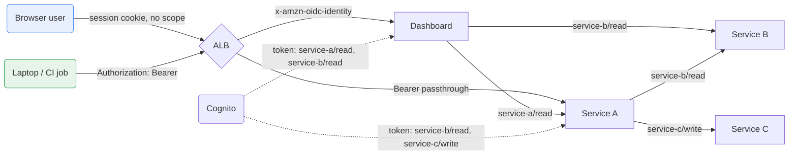

I'm building tools that help scientists run their day-to-day work.  I work in a heavily regulated environment, subject to both U.S. and European digital policy requirements.  The scenario we face regularly is: two services talk to each other. Then three. A dashboard calls a backend API, that API calls another one, a nightly job calls all of them.  Somewhow, we have to answer how one service proves to another that it is allowed to make the call.  

The first way I addressed this was to use Internal Bearer Tokens.  Basically, you generate a long random string, store it in the AWS Secrets Manager, inject it into every service as an environment variable, have each service check inbound requests for it.

I replaced that solution with Cognito's OAuth2 client-credentials flow.  Here each service carries its own identity and each endpoint declares the scope it requires. We didn't need to define any new infrastructure for this, since Cognito was already authenticating browser users through the ALB, so the service-to-service (S2S) path ended up reusing the same user pool, the same JWKS endpoint, and the same validation code that was already there.

---

## Why a shared bearer token was not viable

The bearer token approach was really easy, but it wasn't a viable approach in the long run, for a few reasons:

**No expiry.** A static token has no TTL. If it leaks through a log line, a memory dump, or a compromised container, it stays valid until you manually rotate it and run a redeploy of every service holding it. There is no safe window during rotation where both the old and new values work, unless you write that special-casing yourself.

**No identity.** When service B receives the token, it can verify the value matches what it was given, but it can't tell *who* sent it. Every caller is indistinguishable, so you can only observe that the token was used.

**No scope.** The receiving service has no way to enforce what the caller may do. Either it accepts the token and grants full access, or it rejects it. There's no way to express "service A may read but not write".

**Shared blast radius.** The same secret works everywhere. One compromised service exposes the key to every other service, so a single breach leaves a huge hole.

Comparing these two solutions against each other, we have:

| Property | Static bearer token | Cognito client credentials |
|---|---|---|
| Expiry | Never | ~1 hour, auto-refreshed |
| Identity | None (opaque string) | Signed JWT with a `client_id` claim |
| Scope enforcement | Impossible | Per-endpoint, per-caller |
| Compromise blast radius | All services, indefinitely | One service, for TTL |
| Rotation | Manual, coordinated redeploy | Automatic |
| Auditability | "the token was used" | "service A called endpoint X" |

Being able to attribute traffic to a caller enhances the utility of logs, which is most of the subject of [my next post](  ).

---

## Two gates

There are two authentication and authorization gates in this architecture:

**Gate 1 is the ALB.** Everything in our system is either accesible from outside our VPC via the ALB, or has ingress/egress restricted to within the VPC.  The ALB decides only *how a request gets in*: either this is an authenticated browser user who must complete an interactive Cognito login, or it's a caller to hand straight to the service. The ALB knows nothing about your application's permissions.

**Gate 2 is the service.** It validates *identity* and enforces *scope*. This is the real authorization check for S2S communication.  It behaves identically no matter what language or host the caller runs on.

An incoming request has to clear both. A browser user who hasn't been authenticated gets a 302 status to the Cognito login page via Gate 1 and never reaches the dashboard or API. A service with a valid token but the wrong scope passes Gate 1 but receives a 403 at Gate 2.

```
caller ──▶ [ Gate 1: ALB ] ──▶ [ Gate 2: service ] ──▶ your handler
            browser or machine?   who are you, and what may you do?
              │ browser,            │ no or invalid credential
              │ not logged in       │ valid token, wrong scope
              ▼                     ▼
         302 → Cognito login     401 / 403
```

---

## What services can call what

Below is a diagram of allowed communication.  Solid arrows are requests, and each one is labeled with the scope it must present. Dashed arrows are token issuance.



A browser user reaches the dashboard with no scope at all, because the ALB already authenticated them interactively and the dashboard is the thing they're allowed to look at. The dashboard's own token is *narrower* than service A's: it can read service A and service B, but nothing grants it write access to service C. If the dashboard is compromised, the write path isn't reachable from there.

The permissions are just a table, so adding a consumer means adding a row, not changing any service's code:

| App client (the caller) | Allowed scopes |
|---|---|
| `dashboard` | `service-a/read`, `service-b/read` |
| `service-a` | `service-b/read`, `service-c/write` |
| `ci-runner` | `service-a/read` |
| `developer` | `service-a/read`, `service-b/read` |

---

## Cognito resource servers, custom scopes, and app clients

### The resource server defines capabilities

A **resource server** represents a service that exposes capabilities. It has two
name-like fields that do very different jobs:

```hcl
# terraform code

resource "aws_cognito_resource_server" "service_b" {
  user_pool_id = var.cognito_user_pool_id

  # The scope prefix. Opaque string, conventionally a URL. Immutable in practice.
  identifier = "https://api.example.com/service-b"

  # Console display name only. Nothing references it.
  name = "service-b"

  scope {
    scope_name        = "read"
    scope_description = "Read access to service-b"
  }

  scope {
    scope_name        = "write"
    scope_description = "Write access to service-b"
  }

  scope {
    scope_name        = "admin"
    scope_description = "Administrative access to service-b"
  }
}
```

The `identifier` field becomes the prefix of every scope the
resource server defines, so the three scopes above are really:

```
https://api.example.com/service-b/read
https://api.example.com/service-b/write
https://api.example.com/service-b/admin
```

That full string is what a client requests, what appears in the JWT's `scope`
claim, and what a service compares against. `name` is a display label in the
console and is referenced by nothing.

### Only custom scopes work for machine-to-machine

The client-credentials flow works **only** with custom scopes from a resource server.  I defined these scope manually in my FastAPI applications, and decorated the relevant endpoints with their respective scopes.  The built-in OpenID scopes (`openid`, `email`, `profile`, `aws.cognito.signin.user.admin`)
are for user-facing flows, and asking for one with `grant_type=client_credentials`
fails. Every machine caller needs at least one resource server to exist,
even if the service it calls has exactly one capability.

The app client also needs a secret and the flow explicitly enabled. A client
without `generate_secret` cannot do client credentials at all, and the user pool
needs a domain configured, since the token endpoint lives at
`https://<domain>.auth.<region>.amazoncognito.com/oauth2/token`.

### The app client selects a subset

An **app client** represents a caller of a service. One per calling service, with
`allowed_oauth_scopes` listing every downstream capability it may request:

```hcl
resource "aws_cognito_user_pool_client" "service_a_m2m" {
  name         = "service-a-m2m"
  user_pool_id = var.cognito_user_pool_id

  generate_secret                      = true
  allowed_oauth_flows_user_pool_client = true
  allowed_oauth_flows                  = ["client_credentials"]

  # Full scope strings, exactly as composed above.
  allowed_oauth_scopes = [
    "https://api.example.com/service-b/read",
    "https://api.example.com/service-c/write",
  ]

  # Cognito validates that each scope exists, so the resource servers
  # must be created first. Terraform will not infer this ordering.
  depends_on = [
    aws_cognito_resource_server.service_b,
    aws_cognito_resource_server.service_c,
  ]
}
```

Service A is granted `read` on service B, and `write` on service C. It cannot write to service B even though that scope exists, because its app client never lists it as a viable permissions.  Cognito rejects an app client referencing a scope that doesn't exist yet, and Terraform sees no dependency between the two resources because the scope is a hand-written string rather than a reference to the resource server's attributes.

**Scopes model capabilities, not consumers.** Service B declares that reading,
writing, and administering are things that can be done to it (this is defined both in the FastAPI code via decorated endpoints, and in the Cognito resource server). But Service B doesn't say anything about who can take those actions. Consumers get assigned action permissions through their app client's allowed-scopes list.

That separation lets you onboard a caller without touching the
service being called. A new consumer is one app client and one secret. Service B
does not redeploy, does not learn the new caller's name, and does not grow a
config entry. Its code already says `require_scope("read")` and will keep saying
that no matter how many services eventually call it.

### Two possible gotchas

**An omitted scope parameter is not the same as no scopes.** If a token request
leaves `scope` off entirely, Cognito issues a token carrying *every* scope the app
client is allowed. This means that every downstream call then presents maximum privilege. Always request scopes explicitly, one per downstream call. This is also why caching tokens per scope rather than per client matters.

**Removing a scope is harder than adding one.** Cognito will not let you delete a
scope from a resource server while an app client still lists it in
`allowed_oauth_scopes`. The order is: remove it from every app client, apply, then
remove it from the resource server. In Terraform that's two applies, and doing it
in one produces an error that names the resource server rather than the app client that's actually the problem.

## Validating a token

The receiving side has to check four things:

1. The **signature**, against Cognito's public JWKS for the pool.
2. The **issuer**, so a token from some other pool isn't accepted.
3. `token_use == "access"`, so an ID token can't be substituted for an access token.
4. The **scope claim** contains the specific scope the endpoint requires.

```python
def _decode_token(self, token: str) -> dict:
    signing_key = self._jwk_client.get_signing_key_from_jwt(token)

    claims = jwt.decode(
        token,
        signing_key.key,
        algorithms=["RS256"],
        issuer=self.issuer,
        # Client-credentials tokens carry `client_id` instead of `aud`,
        # so skip audience verification and check token_use instead.
        options={"verify_aud": False},
    )

    if claims.get("token_use") != "access":
        raise HTTPException(401, "wrong token type")

    return claims
```

Client-credentials tokens have no `aud` claim.  Instead, they carry `client_id` , so leaving audience verification on rejects every valid S2S token with a confusing error. Turning it off here is valid, but only because `token_use` and the issuer are being checked instead.

Scope enforcement then becomes a dependency on the router:

```python
full_scope = f"{self.resource_server_id}/{self._scope}"
if full_scope not in claims.get("scope", "").split():
    raise HTTPException(403, f"token missing required scope: {full_scope}")
```

```python
app    = FastAPI(dependencies=[Depends(auth)])                       # authenticated everywhere
router = APIRouter(dependencies=[Depends(auth.require_scope("read"))])  # plus a scope
```

There is also a design decision buried here. Browser requests arriving with ALB OIDC headers pass the scope check without a scope, since the ALB already authenticated the human interactively and browser sessions have no scopes to check.

---

## Fetching a token

The outbound half fetches tokens from Cognito and caches them until they expire.

**Cache per scope, not per client.** A service calling three downstream APIs holds three tokens, each carrying only the access it needs for that call.

**Guard the refresh with a lock, and re-check inside it.** Under concurrent load, several coroutines will notice the expired token at the same moment and all stampede Cognito's token endpoint:

```python
async def get_token(self, scope: str) -> str:
    cached = self._tokens.get(scope)
    if cached and time.time() < cached.expires_at:
        return cached.access_token

    if scope not in self._locks:
        self._locks[scope] = asyncio.Lock()

    async with self._locks[scope]:
        # Re-check inside the lock: another coroutine may have fetched already.
        cached = self._tokens.get(scope)
        if cached and time.time() < cached.expires_at:
            return cached.access_token
        self._tokens[scope] = await self._fetch_new_token(scope)
        return self._tokens[scope].access_token
```

Expiry is stored with a 60 second skew subtracted, so a token is treated as expired slightly before Cognito thinks so. Without that, a token that passes the check and then spends 400ms in flight can arrive already invalid.

---

## Required ALB rules

If your ALB has a Cognito authentication action on its listener rule, it applies to *every* request on that rule. A service presenting a valid Bearer token gets a 302 redirect to the Cognito login page. It never reaches your service, so all that careful token validation never runs.

The listener needs to rules, defined in order:

1. **Higher priority:** match requests carrying an `Authorization: Bearer` header and `forward` them straight to the EC2 target group, with no authenticate action.
2. **Lower priority:** everything else gets `authenticate-cognito` and the normal browser login.

### Gotcha! Source-IP bypass breaks browser login

With respect to Gate 1, you could also consider matching on **source IP** instead, forwarding anything from an allowlisted CIDR. This fixes Gate 1, and Gate 2 is unchanged either way.

However, a source-IP matching rule forwards *without* running the authenticate action.  So once you allowlist the office or VPN range, a person opening a dashboard in a browser from that network skips the login entirely and arrives with no session and no token.  This is DEFINITELY NOT what you want, because we want all requests to be authenticated.  This is specific to browser users, and S2S communication still works.

Also, allowlisting the **VPC's own CIDR** admits in-VPC services only. A public ALB sees a laptop's corporate or VPN *egress* IP. That address is nowhere near the VPC range. So a VPC-CIDR rule never admits laptops, even on VPN. If in-VPC calls work and laptops get redirected to a login page, this is why.

### Gotcha! Header bypass can worsen an authentication bug

We trust browser requests based on the presence of the `x-amzn-oidc-identity` header, and that the browser path skips scope checks. That's normally safe, because the ALB's Cognito action *overwrites* that header on every request it processes, so a client can't forge it.

A bypassed request doesn't run that action, so with a header-match rule, anyone on the internet can send:

```
Authorization: Bearer anything
x-amzn-oidc-identity: someone@example.com
```

The first header triggers the bypass. The second makes your service treat the request as an authenticated browser user, which skips the scope check entirely. The `Bearer` value is never validated, because the ALB-header path returns before the token path is reached.

The mitigations, either of which closes it:

- **Strip inbound `x-amzn-oidc-*` headers on the bypass path**, so only the ALB can ever set them.
- **Dont trusting identity by presence of the header alone.** Verify the signed `x-amzn-oidc-data` JWT rather than reading `x-amzn-oidc-identity` as a plain string.

The second is the better fix because it removes a whole class of bugs instance of one instance of it.

---

## Calling it from anywhere

Something that confused me initially was that `curl` requests from the CLI would fail.  But this was because we weren't passing in any form of authentication into the request, which made local testing or scenarios like calling a service directly from an EC2 instance, fail.  I enabled this functionality with two HTTP steps that are pretty much identical in Python, Java, or a shell script:

```bash
TOKEN=$(curl -s -X POST "https://<domain>.auth.<region>.amazoncognito.com/oauth2/token" \
  -u "$CLIENT_ID:$CLIENT_SECRET" \
  -d grant_type=client_credentials \
  -d 'scope=https://api.example.com/service-a/read' | jq -r .access_token)

curl "https://api.example.com/service-a/things" -H "Authorization: Bearer $TOKEN"
```

A Python client is a convenience wrapper around these steps -- it's not the ONLY way to run this authorization flow. Anything that can make an HTTPS request can participate.  But we might want to alleviate this by building in a seperate app client for developers and for automation purposes.

---

## Wrapping up

This was a pretty approachable problem, especially since we already had the infrastructure in place. We were already using Cognito to authenticate browser users through the ALB, and the client-credentials flow runs against the same user pool, the same JWKS endpoint, and the same validation code. We just needed one more OAuth flow on the system already in place.
